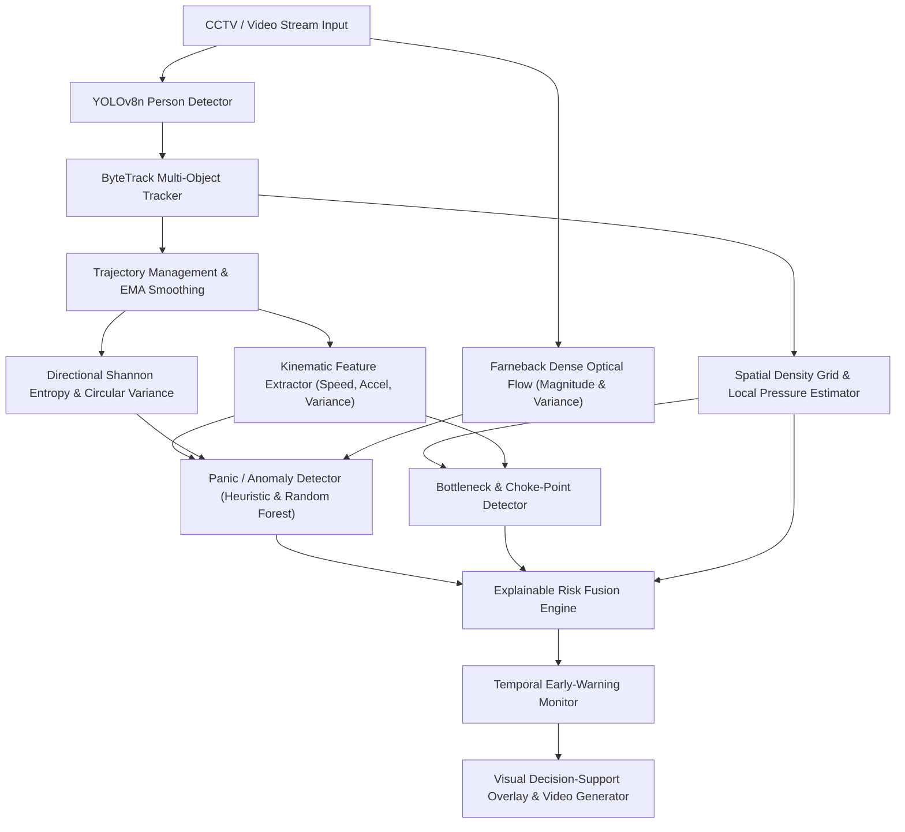

# AI-Based Crowd Panic, Bottleneck and Risk Prediction System for Real-Time Evacuation Safety

[](https://www.python.org/)
[](https://opensource.org/licenses/MIT)
[](https://github.com/ultralytics/ultralytics)

> **Research Prototype & Decision-Support System**  
> *Original Academic Minor Project Implementation*

---

## 📌 Problem Statement & Motivation

Stampedes, sudden panics, and bottleneck crushes in high-density gathering places (stadiums, transit hubs, pilgrimage routes, festivals) lead to catastrophic loss of life when crowd dynamics cross critical pressure thresholds. Conventional surveillance relies on passive human monitoring, which frequently fails to identify pre-stampede congestion signals in time.

This project delivers an **AI-based Decision-Support System** that continuously analyzes surveillance video feeds in real time to detect:
1. **Sudden Motion Surges / Panic Dispersions** (via kinematic velocity spikes, directional entropy disorder, and dense optical flow)
2. **Spatial Bottlenecks / Choke Points** (via localized density accumulation and speed deceleration)
3. **Unified Risk Levels with Early Warning Alerts** (via explainable multi-indicator fusion)

---

## 🏗️ System Architecture



---

## 🔬 Core Mathematical & Algorithmic Formulations

### 1. Directional Shannon Entropy ($H_{dir}$)
To quantify crowd chaos and disordered movement during panic, directions $\theta_i \in [0, 360^\circ)$ are binned into $K=8$ angular sectors:
$$p_k = \frac{N_k}{\sum_{j=1}^K N_j}, \quad H = -\sum_{k=1}^K p_k \log_2(p_k)$$
Normalized direction entropy:
$$H_{norm} = \frac{H}{\log_2(K)} \in [0, 1]$$
*(Values close to 0 denote orderly unidirectional flow; values close to 1 denote turbulent multidirectional panic.)*

### 2. Bottleneck Detection Score ($S_{bottle}$)
Combines local density concentration, velocity stagnation, and trajectory turbulence:
$$S_{bottle} = w_d \cdot D_{cell} + w_v \cdot \max\left(0, 1 - \frac{\bar{v}_{cell}}{v_{free}}\right) + w_f \cdot \left(\frac{H_{norm} + \text{Var}_{circ}}{2}\right) + w_i \cdot \text{Irreg}_{norm}$$

### 3. Explainable Risk Fusion ($R$)
$$R = w_p \cdot S_{panic} + w_b \cdot S_{bottle} + w_d \cdot D_{global} \in [0, 1]$$
- **$0.00 - 0.29$**: LOW (Normal flow)
- **$0.30 - 0.59$**: MODERATE (Monitoring advised)
- **$0.60 - 0.79$**: HIGH (Elevated risk)
- **$0.80 - 1.00$**: CRITICAL (Immediate intervention / evacuation alert)

### 4. Early Warning Mechanism
Suppresses single-frame noise by verifying sustained elevation ($R \ge \tau$ for $N \ge 10$ consecutive frames) or rapid positive slope ($\frac{dR}{dt} > \delta$).

---

## 📂 Project Structure

```
CrowdRisk-Prediction/
├── README.md                      # Academic documentation & manual
├── requirements.txt               # Dependencies
├── .gitignore                     # Git safety filter
├── run.py                         # Master CLI entry point
│
├── config/
│   └── config.yaml                # Master system parameters
│
├── data/
│   ├── videos/                    # Input video storage (ignored by git)
│   └── umn_metadata.json          # Dataset ground truth annotations
│
├── models/
│   └── panic_rf.joblib            # Trained Random Forest classifier
│
├── results/
│   ├── annotated_output.mp4       # Rendered telemetry video
│   ├── features.csv               # Extracted per-frame feature vectors
│   ├── risk_timeline.csv          # Risk and alert time series
│   ├── metrics.json               # Model validation metrics
│   ├── confusion_matrix.png       # Confusion matrix visualization
│   ├── roc_curve.png              # ROC-AUC evaluation curve
│   └── summary.json               # End-of-run executive summary
│
├── src/
│   ├── detection/                 # YOLOv8n detector & fallbacks
│   ├── tracking/                  # ByteTrack & Trajectory management
│   ├── features/                  # Motion kinematics, Optical Flow, Density
│   ├── bottleneck/                # Bottleneck & choke-point engine
│   ├── panic/                     # Motion-based & ML panic detectors
│   ├── risk/                      # Multi-indicator risk fusion
│   ├── warning/                   # Temporal early warning engine
│   ├── visualization/             # HUD telemetry & overlay renderer
│   └── pipeline.py                # Pipeline orchestrator
│
├── scripts/
│   ├── download_demo.py           # Demo video downloader & synthetic generator
│   ├── prepare_umn.py             # UMN dataset segment preparer
│   ├── extract_features.py        # Batch feature extractor
│   ├── train_random_forest.py     # Random Forest training script
│   └── evaluate.py                # Ground truth evaluation script
│
├── tests/                         # Pytest unit test suites
└── docs/
    ├── PROJECT_STATE.md           # Implementation state tracker
    └── SESSION_HANDOFF.md         # Session handoff documentation
```

---

## 🚀 Installation & Quick Start

### 1. Prerequisites & Virtual Environment
```bash
git clone <repository-url>
cd CrowdRisk-Prediction
pip install -r requirements.txt
```

### 2. Generate or Download Demo Video
```bash
python scripts/download_demo.py
```
*(Creates `data/videos/demo.mp4` for immediate offline testing).*

### 3. Run Live Demonstration Mode
```bash
python run.py --source data/videos/demo.mp4 --demo
```

---

## 📊 Evaluation & Machine Learning Training

### 1. Feature Extraction & Training
```bash
python scripts/prepare_umn.py
python scripts/extract_features.py
python scripts/train_random_forest.py
```

### 2. Model Performance
- **Validation Classifier**: Random Forest (100 estimators, balanced class weights)
- **Feature Set**: Kinematic velocity, direction entropy, circular variance, Farneback optical flow magnitude/variance, spatial density.
- **Output Artifacts**:
  - `results/metrics.json`
  - `results/confusion_matrix.png`
  - `results/roc_curve.png`

---

## 🧪 Running Unit Tests

Run the complete test suite across entropy, density, risk fusion, bottleneck, and early warning modules:
```bash
pytest
```

---

## ⚠️ Limitations & Ethical Considerations
1. **Decision Support Only**: This software is a research prototype intended for decision assistance and does not guarantee complete disaster prevention.
2. **Camera Perspective**: Top-down or high-angle angled cameras produce the most accurate spatial density estimates. Extreme oblique angles may cause perspective occlusion.
3. **Lighting & Occlusion**: Optical flow and person bounding boxes may degrade in extreme darkness or heavy smoke without thermal/infrared sensors.

---

## 📚 References & Research Citations
1. **UMN Unusual Crowd Activity Dataset**: University of Central Florida, CRCV. [https://www.crcv.ucf.edu/projects/Abnormal_Crowd/](https://www.crcv.ucf.edu/projects/Abnormal_Crowd/)
2. **ByteTrack**: Zhang et al., *"ByteTrack: Multi-Object Tracking by Associating Every Detection Box"*, ECCV 2022.
3. **Farnebäck Optical Flow**: Gunnar Farnebäck, *"Two-Frame Motion Estimation Based on Polynomial Expansion"*, SCIA 2003.
4. **YOLOv8**: Ultralytics, 2023.
