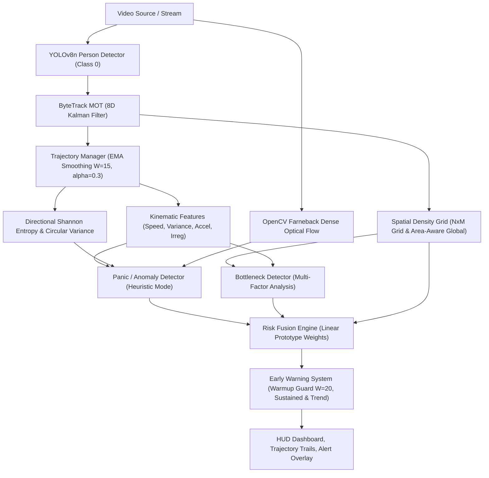

# Baseline Freeze Audit

**Project:** AI-Based Crowd Panic, Bottleneck and Risk Prediction System for Real-Time Evacuation Safety  
**Audit Date:** October 2026  
**Status:** FROZEN & VERIFIED  

---

## 1. System Architecture & Component Mapping

---

## 2. Verified Formulas & Logic

1. **Global Area-Aware Density:**
   $$\text{area\_mpx} = \frac{W \times H}{10^6}, \quad \text{persons\_per\_mpx} = \frac{\text{person\_count}}{\max(0.01, \text{area\_mpx})}$$
   $$\text{density} = \text{clip}\left(\frac{\text{persons\_per\_mpx}}{\text{reference\_density\_per\_mpx}}, 0.0, 1.0\right) \quad [\text{reference} = 200.0]$$
2. **Directional Shannon Entropy:**
   $$p_k = \frac{\text{count}_k}{\sum \text{count}_k} \quad (K=8 \text{ bins}), \quad H_{norm} = \frac{-\sum p_k \log_2(p_k)}{\log_2(8)} \in [0, 1]$$
3. **Bottleneck Score:**
   $$\text{bottleneck} = \text{clip}(0.30 D_{local} + 0.30 S_{loss} + 0.20 F_{imbalance} + 0.20 I_{irreg}, 0.0, 1.0)$$
4. **Baseline Risk Fusion:**
   $$\text{overall\_risk} = \text{clip}(0.45 \cdot \text{panic} + 0.40 \cdot \text{bottleneck} + 0.15 \cdot \text{density}, 0.0, 1.0)$$
5. **Early Warning Warm-up Guard:**
   Alerts suppressed when $\text{frame\_id} < \text{warmup\_frames} (20)$. Evaluates sustained high risk ($\ge 0.60 \times 10\text{ frames}$) or rapid escalation ($\text{risk} \ge 0.50$, $\text{slope} \ge 0.025$) post-warmup.

---

## 3. Verified Test & Run Results

- **Unit Tests:** `pytest -q` $\to$ **9 passed** in 1.73s.
- **Synthetic Demo (`demo.mp4`):** 160 frames, Max Risk = 0.39, Warning = NO, processed at ~67 FPS.
- **Real Crowd Video (`production_id_...mp4`):** 731 frames, 406 max people, Warning triggered at Frame 126 (4.20s), suppressing initial startup noise at frame 4.

---

## 4. Known Scientific Limitations of Baseline

1. **Synthetic Demo Constraint:** `demo.mp4` is a rule-based animation for offline pipeline verification and cannot serve as real-world panic ground truth.
2. **Real Crowd Ground Truth:** The 24s concert video lacks frame-level panic annotations.
3. **Linear Risk Fusion:** Current prototype weights ($0.45, 0.40, 0.15$) do not account for nonlinear multi-factor interactions.
4. **Explainability Level:** Baseline reports global numbers and bounding boxes, but does not provide cell-localized counterfactual recourse ("what-if" interventions).
